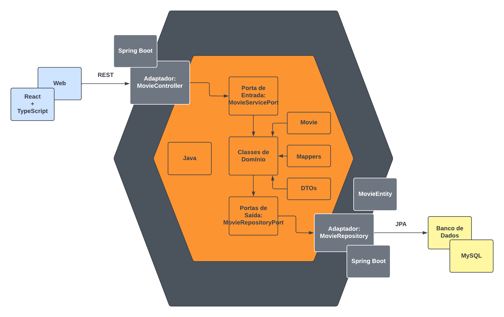
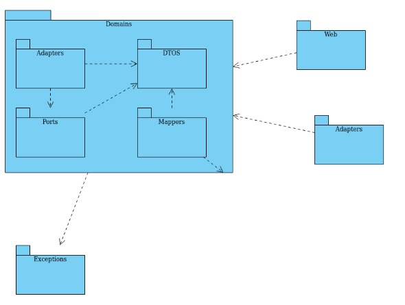

# Banco de Filmes

O objetivo do sistema é fornecer informações sobre os mais diversos filmes na indústria.
Pretendemos criar um banco de dados no Backend que fornece informações como Gênero de
filmes, notas gerais (IMDb), classificação indicativa, sugestão de filme para “assistir agora” e
afins. Iremos ainda criar testes unitários para todo o sistema, buscando um coverage de 80%
no mínimo enquanto dividirmos as subtasks entre os componentes da equipe.

- Linguagens: Java com Spring Boot e ReactJS com TypeScript
- Backlog: [TP de PDS | Trello](https://trello.com/invite/b/EOYUriw7/043fc864e7947228dec9c58ca784468c/tppdsalternativobacklogeafins)
- Figma: [BancoDeFilmes](https://www.figma.com/file/n67ExnIeSd5CPKFcjz1h5m/BancoDeFilmes?node-id=0%3A1)

## Funções dos membros

- Felipe Matheus Guimarães dos Santos: Arquiteto/Dev, responsável pelo refinamento e Implementação;
- Celso Junio Simões de Oliveira Santos: Dev/QA, responsável por implementação, testes e quality;
- Matheus Ferreira Coelho: Dev/UX, responsável pelo Banco de dados, retorno visual e implementação;
- Natan Ventura Menezes: Dev/Analista, responsável por Implementação, Banco de dados e testes.

## Requisitos:

Para começar a utilizar Banco de filmes é necessário atender a alguns pré requisitos básicos que 
apresentaremos a seguir:
- Instalar JDK na versão 17
- Instalar a IDE IntelliJ
- Instalar o Maven
- Instalar Docker
- Instalar MySQL Workbench
- Instalar Postman
- Instalar o Node.js
- Instalar o Yarn (Opcional, pode-se usar o gerenciador padrão do Node também)

Após instalar as ferramentas necessárias, você estará apto a utilizar o sistema de forma completa.

## Step-by-Step
- Para rodar o sistema pela primeira vez, execute um `docker compose up` estando no diretório 
`tp-pds/banco-filmes`.
- Após, execute um `mvn clean install`.
- Então rode o projeto (classe BancoFilmesApplication) no IntelliJ para subir a aplicação.
- Importe o arquivo JSON (pode ser encontrado no diretório "collections" no nosso projeto) para o 
Postman, e então, use as funções que já desenvolvemos até então.
- Para rodar a aplicação do frontend, após já ter instalado o Node.js, navegue até a pasta 
banco-filmes/web e rode no terminal o comando `npm install` para instalar todas as dependências 
(pode demorar um pouco).
- Após concluir a instalação, rode o comando `npm run dev` para subir a aplicação React.

## Possível MVP

Para nosso MVP, planejamos colocar o sistema já funcional com aproximadamente 5 funcionalidades 
básicas no backEnd, com um frontEnd já funcional contendo aproximadamente 5 telas. Ainda,
este será um MVP do tipo Protótipo, pois será uma versão reduzida do projeto final.

### Funcionalidades:
 - findByName: Retorna certas informações sobre um filme tais como o Diretor do mesmo, seu Nome e 
sua Nota.
 - listAll: Comando para listar todos os fiulmes que teremos adicionados ao banco;
 - save: Comando para realizar um post no BackEnd para salvar um filme no Banco;
 - delete: Comando para deletar um filme salvo no banco, sendo este filme definido pelo seu 'id';
 - replace: Atualiza uma entrada do banco com as informações enviadas, através do ID daquela 
entrada;

### Front
Para o frontEnd pretendemos construir 5 telas que estão diretamente relacionadas as nossas funções 
implementadas no Back.
São elas:
- Tela Inicial: Contendo uma preview com os filmes obtidos através do listAll;
- Tela de Filtro/Pesquisa: Inicialmente irá utilizar somente a função de 'findByName' que 
implementaremos e então, podemos adicionar outros filmes se houver tempo hábil;
- Tela de Ranking: Contendo um ranking com os filmes mais bem avaliados no nosso sistema <função 
a definir>;
- Tela do Filme: Contendo informações como sinopses, notas, onde assistir e afins; através da 
função 'findByName'
- Tela de Review/Avaliações: Contendo campos para entradas de notas dos usuários sobre os filmes;

Queremos demonstrar como seria o funcionamento básico do sistema a partir dessas funcionalidades 
implementadas, dando a visão e já explicando que diversas outras funcionalidades seriam 
implementadas caso a ideia estivesse boa, podendo, claro, ocorrer diversas alterações no 
sistema inteiro.

## Backlog Back-end

### Estruturar basicamente o projeto — DONE
Para que os desenvolvedores possam atuar paralelamente, a estrutura básica do projeto precisa 
estar bem definida para que não ocorram muitos conflitos durante as outras estórias do sprint
#### Tarefas:
- 1 - Definir arquitetura do projeto [Time completo]
- 2 - Criar os pacotes referentes às camadas de Controller e Service [Time completo]
- 3 - Criar classe de modelo inicial Movie [Time completo]
- 4 - Criar esqueleto do MovieController e do MovieService [Time completo]
    - 4.1 - O endpoint será mapeado para /movies;
    - 4.2 - Criar atributo da Controller, MovieService, e criar um construtor com esse atributo;
    - 4.3 - Uma lista de Movie será criada no MovieService para que as funcionalidades possam ser 
  testadas, essa lista será estática com algumas informações de filme pré-definidas.

### Listar filmes — DONE
Com a estrutura pronta, pode-se começar a adicionar funcionalidades. Nesta estória, será feito o 
verbo GET, do endpoint /movies. Essa funcionalidade será responsável por retornar todos os 
filmes salvos no banco de dados. Porém, como ainda não se tem uma estrutura de banco de dados 
definida, será retornada a lista de filmes criada anteriormente.
#### Tarefas:
- 1 - MovieService - Criar método listAll(), retornando a lista de filmes [Celso]
- 2 - MovieController - Criar método listAll(), o qual irá chamar o método recém criado no 
MovieService [Celso]
    - Não se esquecer de que o Controller não irá retornar uma classe de domínio do projeto, 
  irá retornar um ResponseEntity dessa classe

### Adicionar filme — DONE
Com a estrutura pronta, pode-se começar a adicionar funcionalidades. Nesta estória, será feito o 
verbo POST, do endpoint /movies. Essa funcionalidade será responsável por adicionar novos filmes no
banco de dados. Porém, como ainda não se tem uma estrutura de banco de dados definida, será 
adicionado à lista de filmes criada anteriormente.
#### Tarefas:
- 1 - MovieService - Criar método save(Movie movie), adicionando movie na lista de Movie.  [Felipe]
- 2 - MovieController Criar método save, o qual irá chamar o método recém criado no MovieService 
[Felipe]
    - Não se esquecer de que o Controller não irá retornar uma classe de domínio do projeto, 
  irá retornar um ResponseEntity do objeto recém-criado.

### Encontrar filme por ID — DONE
Com a estrutura pronta, pode-se começar a adicionar funcionalidades. Nesta estória, será feito outro
verbo GET, do endpoint /movies/{id}. Essa funcionalidade será responsável por encontrar um filme por
ID no banco de dados. Porém, como ainda não se tem uma estrutura de banco de dados definida, será 
encontrado na lista de filmes criada anteriormente.
#### Tarefas:
- 1 - Movie Service - Criar método findById(Long id) [Celso]
    - Itere na lista de filmes e encontre o id passado. Caso não encontre, lance uma exceção do tipo
  NotFoundException.
- 2 - MovieController Criar método findById, o qual irá chamar o método recém criado no MovieService
[Celso]
    - Não se esquecer de que o Controller não irá retornar uma classe de domínio do projeto, irá 
  retornar um ResponseEntity do objeto encontrado.
    - Use a annotation @GetMapping(path = "/{id}") no Controller, pois não podemos ter dois verbos 
  iguais mapeados para o mesmo endpoint.
    
### Remover filmes — DONE
#### Depende da estória "Encontrar filme por ID"
Com a estrutura pronta, pode-se começar a adicionar funcionalidades. Nesta estória, será feito o 
verbo PUT, do endpoint /movies. Essa funcionalidade será responsável por remover filmes no banco de
dados. Porém, como ainda não se tem uma estrutura de banco de dados definida, removerá um filme da
lista criada anteriormente.
#### Tarefas:
- 1 - Movie Service - Criar método delete(Long id) [Celso]
    - Remova da lista o filme usando o método findById, criado na estória anterior;
    - Após, adicione o novo filme na lista.
- 2 - MovieController Criar método replace, o qual irá chamar o método recém criado no MovieService 
[Celso]
    - PUT e DELETE não retornarão o objeto, apenas um ResponseEntity<>(HttpStatus.NO_CONTENT) caso 
  der tudo certo.

### Editar filmes — DONE
#### Depende da estória "Encontrar filme por ID"
Com a estrutura pronta, pode-se começar a adicionar funcionalidades. Nesta estória, será feito o 
verbo PUT, do endpoint /movies. Essa funcionalidade será responsável por editar (sobrescrever) 
filmes no banco de dados. Porém, como ainda não se tem uma estrutura de banco de dados definida, 
removerá um objeto da lista criada anteriormente e adicionará o novo.
#### Tarefas:
- 1 - Movie Service - Criar método replace(Long id) [Celso]
    - Remova da lista o filme usando o método findById, criado na estória anterior;
- 2 - MovieController Criar método delete, o qual irá chamar o método recém criado no MovieService 
[Celso]
    - PUT e DELETE não retornarão o objeto, apenas um ResponseEntity<>(HttpStatus.NO_CONTENT) caso 
  der tudo certo.

### Preparando Projeto Para Persistir Dados — DONE
Persistir dados no banco de dados com a dependência Spring JPA
#### Tarefas:
- 1 - Estudar dependência da JPA [Felipe]
- 2 - Importar dependências necessárias para usar a JPA e criar arquivo docker-compose.yml [Felipe]
- 3 - Criar um repositório para salvar filmes, herdando do repositório da JPA [Felipe]
- 4 - Atualizar o MovieService para poder utilizar o repositório criado anteriormente [Felipe]
- 5 - Atualizar o método save, usando o repositório criado anteriormente [Felipe]
- 6 - Atualizar a controller, e testar o novo método [Felipe]
- 7 - Mostrar resultados para o time [Time completo]

### Persistir Dados — DONE
Persistir dados no banco de dados com a dependência Spring JPA
#### Tarefas:
- 1 - Remover lista pré definida de filmes e atualizar os métodos do MovieService
- 2 - Atualizar a Controller
- 3 - Testar

### Cadastrar usuário — CANCELED
[POC] Estudar como fazer cadastro de usuário utilizando Springboot e apresentar resultados para 
o time. [Felipe]

## Backlog Front-end

### Modelar/prototipar telas no Figma
Para que se tenha uma melhor concepção do que irá ser implementado na interface do usuário, serão 
modeladas telas no Figma para isso e para ver antecipadamente como poderia ser o visual da 
aplicação.
#### Tarefas:
- 1 - Modelar tela principal da listagem de filmes [Natan]
- 2 - Modelar tela de busca/filtragem de filmes [Natan]
- 3 - Modelar tela que mostra mais informações de um filme selecionado [Natan]
- 4 - Modelar tela/modal de avaliação do filme [Natan]
- 5 - Modelar tela de ranking de filmes [Natan]

### Gerar projeto React
Será gerado o projeto do ReactJS com template de TypeScript dentro do trabalho.
#### Tarefas:
- 1 - Gerar projeto/aplicação do React [Matheus]

### Integrar Spring Boot API com React
Para se certificar do funcionamento, serão testados dentro da aplicação React as rotas ou endpoints
do Spring Boot.
#### Tarefas:
- 1 - Verificar resposta do endpoint /movies dentro do React [Matheus]
- 2 - Declarar uma interface com os atributos recebidos do JSON [Matheus]
- 3 - Verificar se o JSON é convertido corretamente para objetos [Matheus]

### Implementar tela principal de listagem de filmes
Fazer a estilização e componentização da tela principal, que exibe os filmes do banco.
#### Tarefas:
- 1 - Estruturar o componente do cabeçalho [Matheus]
- 2 - Estruturar o componente da listagem de filmes [Matheus]
  - Puxar os dados da API do Spring Boot para serem manipulados e listados
- 3 - Estruturar o componente do card dos filmes [Matheus]
- 4 - Estilizar os componentes acima [Matheus]

### Implementar filtro/busca de filmes
Fazer a componentização e estilização da tela que receberá as entradas do usuário para realizar uma
busca no banco de filmes.
#### Tarefas:
- 1 - Estruturar o componente da tela de busca [Matheus]
- 2 - Estilizar o componente [Matheus]
- 3 - Filtrar o banco de filmes e retornar o resultado [Matheus]

### Implementar tela de descrição do filme
Fazer a componentização e estilização da tela que exibirá informações mais detalhadas sobre um filme
que for selecionado pelo usuário, como descrição e notas.
#### Tarefas:
- 1 - Estruturar o componente da tela de descrição [Matheus]
- 2 - Estilizar o componente [Matheus]

### Implementar tela de avaliação do filme
Fazer a componentização e estilização da tela que exibirá 5 estrelas que o usuário deverá selecionar
de acordo com a nota (em estrelas) que ele dará para o filme em questão. Após clicar na quantidade 
de estrelas desejada, o valor computado irá somar a média do filme avaliado.
#### Tarefas:
- 1 - Estruturar o componente da tela de avaliação [Matheus]
- 2 - Estilizar o componente [Matheus]

### Implementar tela da Watch List
Fazer a estilização e componentização da tela da Watch List, que irá exibir a lista com todos os 
filmes que o usuário adicionou.
#### Tarefas:
- 1 - Estruturar o componente da watch list (poderá ser similar ou o mesmo da listagem principal) 
[Matheus]
- 2 - Estilizar o componente [Matheus]
- 3 - Implementar a lógica de salvar e recuperar os filmes da watch list [Matheus]

## Arquitetura

#### Como definido pelo Professor, o projeto seguiu a Arquitetura Hexagonal.
A arquitetura hexagonal foi utilizada para que as classes de domínio estejam desacopladas das 
classes de infraestrutura, tecnologias ou sistemas externos. Desse modo, poderíamos mudar de 
tecnologia no futuro sem impactar as classes de domínio, além de que as classes de domínio podem ser
compartilhadas por várias tecnologias.

#### Portas:
Na arquitetura hexagonal, as portas são as interfaces usadas para se comunicar com as classes de 
domínio.

Portas no projeto:
- `MovieRepositoryPort`: Porta de saída, chama as classes do banco de dados através da classe de 
domínio.
- `MovieServicePort`: Porta de entrada, chama as classes do domínio através da interface web.

#### Adaptadores:
Os adaptadores consistem em estruturas que recebem chamadas de dentro do sistema e direcionam para 
funções externas ou chamadas externas e direcionam para as portas de entrada.

Adaptadores no projeto:
- `MovieRepository`: direciona as chamadas internas do domínio para o banco de dados;
- `MovieController`: recebe as chamadas REST do front-end, e as adapta para o domínio do sistema.

#### Além disso, utilizamos os conceitos de DDD.
O DDD tem o objetivo de centrar o design no domínio do negócio. O domínio é o problema de negócio a 
ser resolvido, no nosso caso, queremos facilitar o acesso do usuário aos filmes e suas principais 
informações, como enredo, notas, onde assistir, etc. Dessa forma, caso quisermos atualizar o banco 
de dados, ou a framework de desenvolvimento, não precisaremos modificar nada no domínio, pois ele 
está livre de tecnologia, neste caso, é Java puro.

#### Entidade
- `Movie`: nessa entidade temos os atributos de um filme e getters e setters para acessá-los.

#### Objeto de valor
- `Title`: Nome do filme
- `GenreEnum`: Nesse arquivo definimos os gêneros que possuímos no filme, não possuindo 
identificador único.

#### Agregado 
Objeto Raiz
- `Lista de Filmes`: Lista de filmes de um determinado usuário

Objeto Interno
- `Filme da Lista`: Filme que compõe a lista de um determinado usuário

#### Serviço
- `MovieService`: É onde definimos as lógicas de negócio importantes realizadas nos filmes no nosso 
domínio, tais como encontrar filmes por título, salvar filmes, deletar filmes, avaliar filme e etc.

#### Repositório
- `MovieRepository`: Classe utilizada para recuperar filmes do nosso banco de dados.
